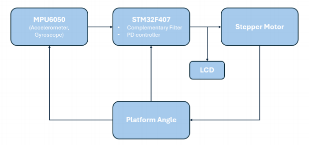
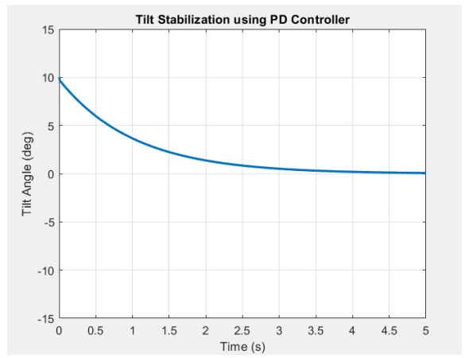

# STM32 Tilt-Stabilized Platform

Real-time closed-loop tilt stabilization system built using an STM32F407 microcontroller, MPU6050 IMU, and motor actuation.
The system measures platform tilt, estimates orientation using a complementary filter, and applies PD feedback control to correct the tilt in real time.

## Features

- STM32F407 embedded firmware
- MPU6050 communication over I2C
- Complementary filter for tilt estimation
- PD feedback controller
- PWM-based stepper motor actuation
- UART debugging
- LCD monitoring

## Hardware

- STM32F407G-DISC1
- MPU6050 IMU
- Stepper motor
- Motor driver
- 16x2 LCD

## Software & Tools

- Embedded C
- STM32CubeIDE
- STM32 HAL
- I2C
- UART
- PWM
- Timers

## Project Overview

The system reads motion data from the MPU6050, estimates platform tilt, applies feedback control, and generates motor commands to stabilize the platform in real time.

## System Architecture

## Results and Testing

- The platform responded effectively to external tilts.
- Some oscillation was observed during controller tuning, but performance improved through gain adjustment and filtering.
- The final embedded implementation used a PD controller with:
  - **Kp = 1.0**
  - **Kd = 0.01**
- The final system demonstrated stable behavior and successful tilt correction along the tested axis.

MATLAB was also used during development to study controller response and support tuning.

